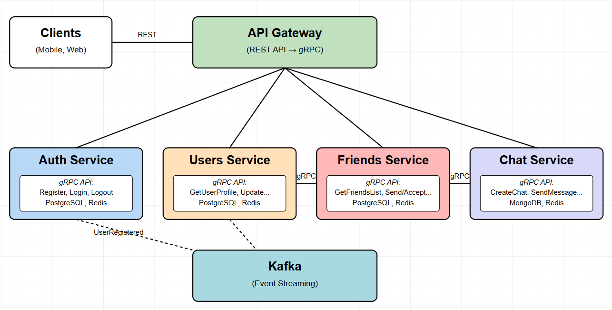

# Messenger App



## Архитектура приложения

### API Gateway

**Отвечает за:**

Маршрутизацию и проксирование клиентских запросов к внутренним сервисам.

**Предоставляет API:**

- REST API для внешних клиентов (мобильные, веб-клиенты), проксирует запросы на Auth, Users, Friends, Chat сервисы.

---

### Auth Service

**Отвечает за:**

Регистрацию и авторизацию пользователей (email+пароль и OAuth).

**Хранит:**
- Email
- Password hash
- OAuth ID
- User ID (ссылка на Users service)

**База данных:**
- PostgreSQL (для обеспечения ACID)
- Redis (кэширование токенов, сессий пользователей и результатов частых запросов для снижения нагрузки на основную БД)

**Взаимодействует:**
- Асинхронно публикует события для Users service через Kafka.

**Предоставляет API:**
- gRPC:
    - `Register`
    - `Login`
    - `Logout`

**События:**
- Публикует:
    - `UserRegistered (UserID)`

---

### Users Service

**Отвечает за:**

Хранение и управление профилем пользователя, поиск пользователя по никнейму.

**Хранит:**
- UserID
- Nickname (уникальный)
- Description (bio)
- Avatar URL

**База данных:**
- PostgreSQL (для обеспечения ACID)
- Redis (кэширование профилей активных пользователей и результатов поиска для ускорения доступа к часто запрашиваемым данным)

**Взаимодействует:**
- Подписывается на события от Auth service через Kafka.
- Предоставляет данные по gRPC для других сервисов (Friends, Chat).

**Предоставляет API:**
- gRPC:
    - `GetUserProfile(UserID)`
    - `GetUserProfileByNickname(Nickname)`
    - `UpdateUserProfile(UserID, ProfileData)`

**События:**
- Подписывается:
    - `UserRegistered`

---

### Friends Service

**Отвечает за:**

Управление списком друзей, отправку и подтверждение заявок в друзья.

**Хранит:**
- UserID
- FriendID
- Status (`Requested`, `Accepted`, `Rejected`)
- CreatedAt, UpdatedAt

**База данных:**
- PostgreSQL (хранение реляционных данных и статусов дружбы)
- Redis (кэширование списков друзей, активных запросов на дружбу и статусов онлайн для быстрого доступа)

**Взаимодействует:**
- Запрашивает данные пользователя по gRPC из Users service.
- Асинхронно публикует события через Kafka.

**Предоставляет API:**
- gRPC:
    - `GetFriendsList(UserID)`
    - `SendFriendRequest(UserID, FriendNickname)`
    - `AcceptFriendRequest(UserID, FriendNickname)`
    - `RejectFriendRequest(UserID, FriendNickname)`
    - `RemoveFriend(UserID, FriendNickname)`

---

### Chat Service

**Отвечает за:**

Создание чатов и обмен сообщениями между пользователями.

**Хранит (MongoDB):**
- ChatID
- Participants: `[UserID1, UserID2]`
- Messages:
    - MessageID
    - AuthorID
    - Content
    - Timestamp

**База данных:**
- MongoDB (удобна для неструктурированных данных, истории сообщений и быстрого чтения больших коллекций)
- Redis (кэширование активных чатов, последних сообщений и статусов доставки для ускорения доступа и уменьшения задержек)

**Взаимодействует:**
- Запрашивает данные пользователей по gRPC из Users service.
- Проверяет статус дружбы по gRPC из Friends service.
- Асинхронно публикует события через Kafka.

**Предоставляет API:**
- gRPC:
    - `CreateChat(Participants)`
    - `GetUserChats(UserID)`
    - `SendMessage(ChatID, AuthorID, Content)`
    - `GetChatHistory(ChatID)`

## Запуск приложения локально с помощью Docker

1. **Клонирование репозитория**:
   ```bash
   git clone https://github.com/your-username/messenger-app.git
   cd messenger-app
   ```

2. **Запуск всех сервисов через Makefile**:
   ```bash
   make build  
   make up     
   ```

   Напрямую через Docker Compose:
   ```bash
   docker-compose build
   docker-compose up -d
   ```

3. **Проверка работоспособности**:
   Все сервисы будут доступны по следующим адресам:
   - Auth Service: http://localhost:8001
   - Chat Service: http://localhost:8002
   - Friends Service: http://localhost:8003
   - Users Service: http://localhost:8004


4. **Остановка сервисов**:
   ```bash
   make down       
   ```

## Развертывание в Kubernetes

Приложение поддерживает разные стратегии деплоя в Kubernetes: Blue-Green и Canary.

### Автоматический полный деплой

Для быстрого развёртывания всего приложения в Kubernetes одной командой:

```bash
# Полный автоматический деплой (все шаги)
make k8s-deploy-all
```

Эта команда выполняет все необходимые шаги:
1. Проверяет и запускает Minikube (если не запущен)
2. Включает Ingress addon
3. Собирает и загружает Docker-образы
4. Выполняет Blue-Green деплой
5. Добавляет запись в /etc/hosts
6. Выводит URL'ы для доступа к сервисам

### Blue-Green Deployment

Стратегия Blue-Green позволяет безопасно обновлять версии приложения, обеспечивая нулевое время простоя.

```bash
# Деплой в Kubernetes
make k8s-blue-green

# Переключение на green версию
make k8s-apply-green

# Переключение на blue версию
make k8s-apply-blue
```

### Canary Deployment

Стратегия Canary позволяет постепенно увеличивать трафик на новую версию, минимизируя риски.

```bash
# Деплой в Kubernetes с канареечным релизом
make k8s-canary

# Постепенный переход к новой версии
make k8s-canary-migrate

# Мгновенное переключение на новую версию
make k8s-canary-apply

# Откат к старой версии
make k8s-canary-rollback
```

Для дополнительной информации о Kubernetes-деплое см. [Kubernetes Deployment Instructions](k8s/README.md).